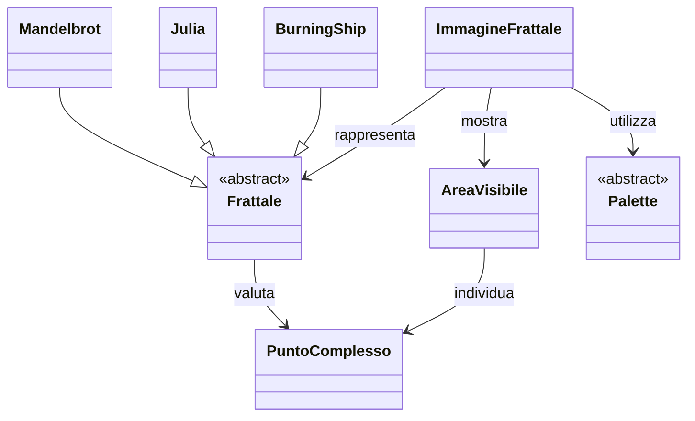
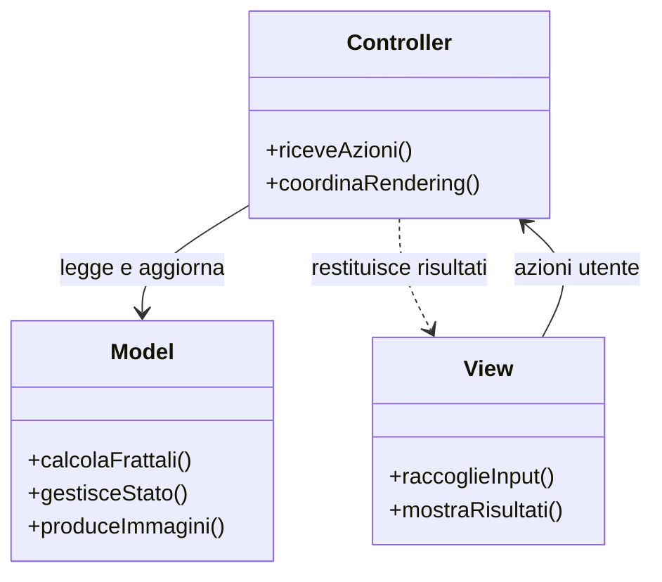
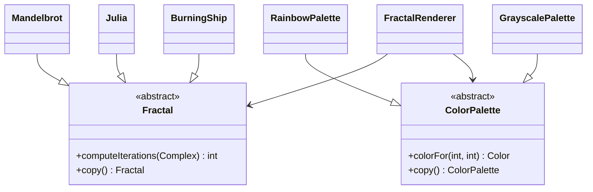
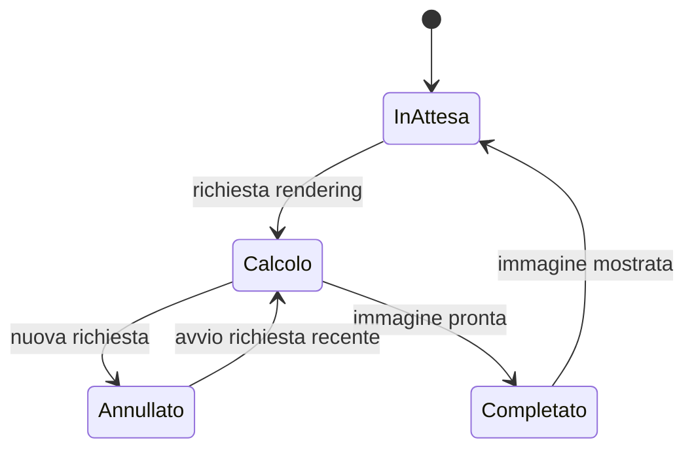
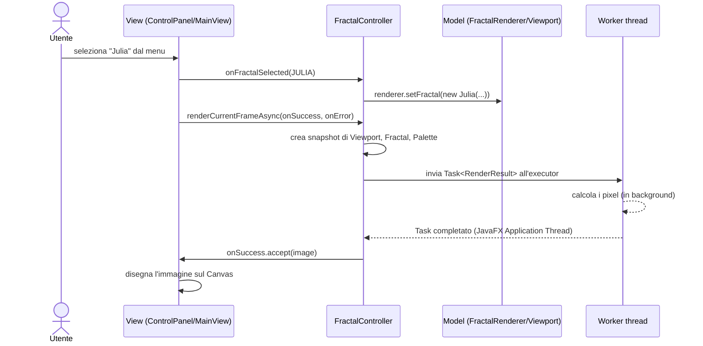
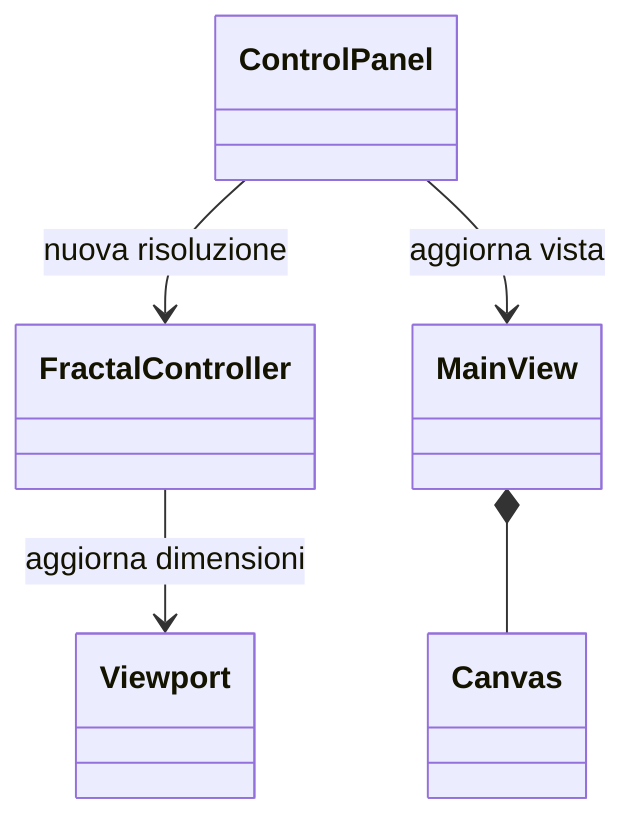
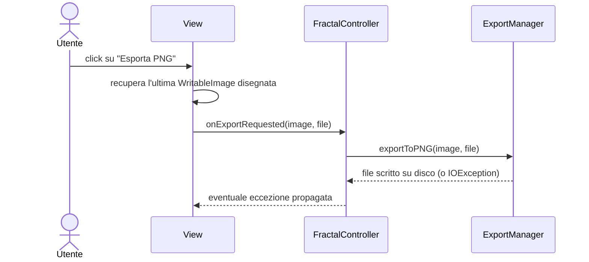

# FractalViewer

**Corso:** Progettazione e Sviluppo del Software  
**Componenti del gruppo:** Biagio Fino, Tommaso Bedetti  
**Tecnologie:** Java 17, JavaFX 21.0.2, Gradle, JUnit Jupiter

## Indice

1. Abstract
2. Analisi
   - Requisiti
   - Analisi e modello del dominio
3. Design
   - Architettura
   - Design dettagliato
4. Sviluppo
   - Testing automatizzato
   - Note di sviluppo
5. Commenti finali
   - Autovalutazione e lavori futuri
   - Difficoltà incontrate e commenti per i docenti
   - Conclusioni
6. Guida utente

## Abstract

FractalViewer è un'applicazione desktop, sviluppata in Java con interfaccia grafica JavaFX, che permette di esplorare in modo interattivo alcuni frattali classici: l'insieme di Mandelbrot, l'insieme di Julia e il frattale Burning Ship. L'utente può muoversi liberamente nell'immagine, ingrandire una zona specifica, cambiare la combinazione di colori usata per rappresentare il frattale, regolare il livello di dettaglio del calcolo (il numero massimo di iterazioni) e infine esportare quanto visualizzato come immagine.

Il progetto nasce con l'obiettivo di costruire un software ben strutturato (i.e.: responsabilità separate, comunicazione attraverso interfacce, modularità). 

Questo report descrive l'analisi del dominio, le scelte architetturali e i pattern di progettazione adottati, il modo in cui il gruppo si è organizzato e la strategia di collaudo seguita.

# Analisi

## Requisiti

### Requisiti funzionali

- Visualizzazione di uno tra tre frattali disponibili (Mandelbrot, Julia, Burning Ship), selezionabile da un menu.
- Scelta della palette di colori tra almeno due opzioni (a colori e in scala di grigi).
- Navigazione della vista tramite zoom centrato sul punto puntato dal mouse e spostamento tramite trascinamento.
- Possibilità di ripristinare la vista iniziale.
- Regolazione del numero massimo di iterazioni tramite uno slider.
- Configurazione della risoluzione dell'immagine (larghezza, altezza), indipendente dalla dimensione della finestra.
- Esportazione dell'immagine correntemente visualizzata.

### Requisiti non funzionali

- L'interfaccia utente deve restare reattiva in ogni momento, anche durante un rendering ad alta risoluzione o con un numero elevato di iterazioni.
- Deve essere possibile abbandonare un calcolo diventato "inutile" (perché l'utente ha nel frattempo compiuto una nuova azione) senza che il suo risultato, una volta pronto, sovrascriva un'immagine più recente.
- L'applicazione deve poter essere estesa con nuovi frattali o nuove palette senza richiedere modifiche sostanziali alle funzionalità già esistenti.
- Gli input non validi (ad esempio una risoluzione nulla o negativa) devono essere gestiti in modo controllato (i.e.: evitare crash del programma).

## Analisi e modello del dominio

Un frattale, nel contesto di questa applicazione, nasce da una regola molto semplice applicata indipendentemente a ogni pixel dell'immagine: si parte da un punto del piano complesso e si itera una formula, osservando se il valore ottenuto resta limitato oppure cresce indefinitamente (in questo caso si parla di fuga). Il numero di iterazioni compiute prima che il valore fugga (oppure il raggiungimento di un tetto massimo di iterazioni, nel qual caso il punto si considera appartenente al frattale) viene poi tradotto in un colore tramite una palette. È la ripetizione di questo procedimento su milioni di pixel, ciascuno con un colore leggermente diverso in base a quante iterazioni gli sono servite, a generare le forme del frattale.

I tre frattali disponibili condividono questa stessa logica generale (iterazione, test di fuga, colorazione) e differiscono solo nella formula applicata a ogni iterazione:

- **Insieme di Mandelbrot**: Si parte da z0 = 0 e si applica ripetutamente z <- z^2 + c, dove c è il punto del piano che si sta testando (quindi è c a variare da pixel a pixel, mentre z parte sempre da zero).
- **Insieme di Julia**: Usa la stessa relazione z <- z^2 + c, ma invertendo i ruoli: il valore c è fissato per l'intero frattale, mentre è il punto testato che funge da valore iniziale z0.
- **Burning Ship**: Riprende la stessa idea di Mandelbrot, ma prima di elevare al quadrato z si prende il valore assoluto della sua parte reale e della sua parte immaginaria separatamente: z <- (|Re(z)| + i|Im(z)|)^2 + c. 

Dal punto di vista del test di fuga, un punto si considera "fuggito" quando il modulo di z supera un raggio di soglia: superata questa soglia, infatti, si può dimostrare che il valore continuerà a crescere indefinitamente.

Gli elementi principali del dominio possono quindi essere riassunti nel frattale da rappresentare, nei punti del piano complesso, nella porzione di piano osservata e nella palette usata per produrre l'immagine. Il seguente diagramma mostra questi concetti e le loro relazioni, senza introdurre dettagli relativi all'implementazione.



# Design

## Architettura

Il progetto adotta il pattern architetturale **MVC (Model–View–Controller)**. I tre componenti hanno responsabilità distinte:

- **Model**: Rappresenta i frattali e lo stato della vista, esegue i calcoli e produce le immagini.
- **Controller**: Riceve le azioni dell'utente, aggiorna il Model e coordina l'avvio dei rendering.
- **View**:  Mostra l'immagine, presenta i controlli e inoltra al Controller le richieste dell'utente.



## Design dettagliato

### Organizzazione del lavoro

Il lavoro è stato suddiviso cercando di assegnare a ciascun componente una parte precisa del progetto. In questo modo è stato possibile sviluppare separatamente le diverse parti e integrarle in modo progressivo nel progetto.

La divisione delle attività ha seguito principalmente la struttura MVC descritta nel capitolo dedicato all'architettura:

* **Biagio Fino** si è occupato soprattutto del Model, realizzando le classi dedicate ai numeri complessi, ai diversi frattali e alla generazione delle immagini. Ha inoltre lavorato sulla gestione dei rendering in background e sull’annullamento dei calcoli non più necessari.
* **Tommaso Bedetti** si è occupato principalmente della View e della configurazione dell’applicazione. Ha realizzato l’interfaccia JavaFX, i controlli disponibili per l’utente, la gestione della risoluzione e la funzione per esportare le immagini.

Prima di iniziare lo sviluppo delle singole parti, sono stati concordati i principali metodi del Controller e il modo in cui Model e View avrebbero comunicato. Questo ha permesso di lavorare separatamente senza perdere la compatibilità tra i diversi componenti.

Le decisioni più importanti, come l’organizzazione generale del progetto e la gestione dei frattali e delle palette, sono state prese insieme. Durante lo sviluppo le diverse parti sono state integrate e provate progressivamente.

### Contributo di Biagio Fino

#### Frattali e palette intercambiabili

##### Problema

Il programma deve poter utilizzare frattali e colorazioni differenti senza modificare ogni volta il motore che genera l'immagine.

##### Soluzione

Per gestire i diversi tipi di frattale è stato utilizzato il pattern Strategy. La classe astratta `Fractal` definisce il comportamento comune necessario al calcolo delle iterazioni, mentre `Mandelbrot`, `Julia` e `BurningShip` ne rappresentano le diverse implementazioni. In questo modo `FractalRenderer` può lavorare con qualsiasi tipo di frattale senza dover conoscere i dettagli dell'algoritmo utilizzato.

La stessa soluzione è stata applicata anche alla gestione dei colori. `ColorPalette` definisce il comportamento comune delle palette, mentre `RainbowPalette` e `GrayscalePalette` implementano due diverse modalità di colorazione. Il renderer rimane quindi indipendente sia dal tipo di frattale scelto sia dalla palette utilizzata.

Una possibile alternativa sarebbe stata gestire direttamente nel renderer i vari casi tramite controlli condizionali. Questa soluzione avrebbe però reso `FractalRenderer` più legato alle singole implementazioni e avrebbe complicato l'aggiunta di nuovi frattali o nuove palette. L'uso di Strategy permette invece di aggiungere nuove varianti senza modificare la logica principale del rendering.



#### Copia dello stato e rendering asincrono

##### Problema

Un rendering può richiedere diversi secondi. Se il calcolo venisse eseguito direttamente dall'interfaccia, il programma smetterebbe temporaneamente di rispondere e potrebbe mostrare risultati ormai superati.

##### Soluzione

Per evitare che l'interfaccia si blocchi durante il calcolo, il rendering viene eseguito in modo asincrono rispetto al thread grafico. Prima di avviare il calcolo, il Controller crea una copia dello stato necessario al rendering, comprendente `Viewport`, frattale e palette. In questo modo ogni elaborazione lavora su uno stato indipendente dalle eventuali modifiche successive effettuate dall'utente.

Le richieste di rendering vengono gestite da un solo worker. Questa scelta evita di eseguire contemporaneamente più calcoli particolarmente pesanti e rende più semplice la gestione delle richieste che non sono più rilevanti.

A ogni rendering viene inoltre associato un identificatore progressivo. Quando viene avviata una nuova elaborazione, quella precedente può essere annullata.
Se dovesse comunque terminare, il suo risultato viene ignorato quando non corrisponde più all'ultima richiesta effettuata. In questo modo soltanto il rendering più recente può aggiornare la View.

Un'alternativa sarebbe stata creare un thread separato per ogni richiesta e lasciare che tutti i rendering venissero completati indipendentemente. Questa soluzione avrebbe però potuto portare all'esecuzione simultanea di più calcoli costosi e rendere più difficile stabilire quale risultato mostrare. L'utilizzo di un solo worker, insieme all'identificatore progressivo, permette invece di dare sempre priorità alla richiesta più recente.




### Contributo di Tommaso Bedetti

#### Comunicazione tra interfaccia e Controller

##### Problema

La View deve inviare le azioni dell'utente senza accedere direttamente alla logica dei frattali, e deve poter ricevere l'immagine calcolata senza bloccare l'interfaccia.

##### Soluzione

Questa parte del progetto applica il pattern architetturale MVC: `MainView` e `ControlPanel` costituiscono la View, `FractalController` coordina le richieste e le classi del Model gestiscono lo stato e i calcoli. In questo modo la logica dei frattali non viene inserita direttamente nell'interfaccia.

La sequenza tipica di interazione (l'utente cambia frattale, la nuova immagine appare a schermo) aiuta a visualizzare come i tre livelli MVC collaborano tra loro:



Il risultato del rendering non viene passato direttamente dal worker alla View. JavaFX esegue gli handler `setOnSucceeded` e `setOnFailed` sul thread dell’interfaccia. Di conseguenza, la callback `onSuccess` può aggiornare in sicurezza i componenti grafici.

Una possibile alternativa sarebbe stata permettere alla View di gestire direttamente alcune operazioni sul Model. Questo avrebbe semplificato inizialmente la comunicazione tra i componenti, ma avrebbe aumentato il legame tra interfaccia grafica e logica applicativa. L'uso del Controller permette invece di mantenere più chiara la separazione delle responsabilità prevista dal pattern MVC.

#### Gestione della risoluzione e della finestra

##### Problema

La risoluzione scelta dall'utente può essere diversa dalla dimensione della finestra e non deve deformare l'immagine né modificarsi automaticamente.

##### Soluzione

La classe `Viewport` rappresenta la porzione di piano complesso attualmente visibile (centro e livello di zoom) e si occupa della conversione tra coordinate pixel del `Canvas` e coordinate del piano complesso. Le operazioni principali sono lo zoom centrato su un punto e il pan.
Una scelta progettuale riguarda l'indipendenza tra la risoluzione logica dell'immagine (le dimensioni usate per il calcolo, memorizzate nel `Viewport`) e lo spazio fisico disponibile a schermo per visualizzarla. 
Il `Canvas` su cui viene disegnata l'immagine è contenuto in uno `ScrollPane`: in questo modo, impostare una risoluzione più alta della finestra non costringe quest'ultima a ingrandirsi né deforma l'immagine, ma rende disponibili delle barre di scorrimento per navigarla. 

Un'alternativa sarebbe stata adattare automaticamente la risoluzione alle dimensioni della finestra. In questo modo, però, ogni ridimensionamento avrebbe modificato anche il rendering. Mantenere separate le due dimensioni permette invece all'utente di scegliere la risoluzione dell'immagine, mentre lo `ScrollPane` gestisce soltanto la sua visualizzazione.



#### Esportazione dell'immagine visualizzata

##### Problema

Il file esportato deve corrispondere esattamente all'immagine mostrata, anche quando l'utente ha appena cambiato un parametro e un nuovo rendering è ancora in corso.

##### Soluzione

L’esportazione è gestita dalla classe `ExportManager`, separata da `FractalRenderer` e `Viewport`. Quando l’utente preme il pulsante di esportazione non viene avviato un nuovo rendering, ma viene salvata l’ultima `WritableImage` mostrata dalla View. In questo modo il file corrisponde all’immagine visibile in quel momento, anche se alcuni parametri sono stati appena modificati. Se non è ancora disponibile un’immagine, viene mostrato un messaggio informativo.

Il flusso dell'esportazione coinvolge direttamente View, Controller ed `ExportManager`:



Un'alternativa sarebbe stata eseguire un nuovo rendering al momento dell'esportazione usando i parametri correnti. In questo caso, però, l'immagine salvata avrebbe potuto essere diversa da quella mostrata a schermo. Per questo motivo viene esportata direttamente l'ultima immagine visualizzata dalla View.

# Sviluppo

## Testing automatizzato

La correttezza della logica di dominio è verificata da una suite di test automatici basata su JUnit Jupiter, eseguibile con un singolo comando Gradle:

```bash
./gradlew test        # gradlew.bat test su Windows
```

Il report HTML dei risultati viene generato in `build/reports/tests/test/index.html`. La suite conta 44 test distribuiti sulle classi principali del progetto: numeri complessi, i tre frattali, il motore di rendering, le due palette, la gestione della viewport, l'esportazione e il Controller (che coordina la selezione di frattale e palette, la modifica delle iterazioni, lo zoom, il pan, il reset della vista e il ridimensionamento del canvas).

## Note di sviluppo

Non sono stati utilizzati o riadattati frammenti di codice provenienti da fonti esterne.

### Note di Biagio Fino

#### Risultato del rendering rappresentato con un record

**Dove:** `fractalvisualizer.model.RenderResult`

**Snippet:**

```java
public record RenderResult(int width, int height, int[] pixels) {
}
```

Il `record` permette di raccogliere dimensioni e pixel dell'immagine in un unico oggetto semplice. In questo modo il calcolo non dipende direttamente dai componenti grafici di JavaFX.

#### Interruzione dei calcoli non più necessari

**Dove:** `fractalvisualizer.model.FractalRenderer`

**Snippet:**

```java
if ((x & 63) == 0 && cancelled.getAsBoolean()) {
    return null;
}
```

Durante il rendering viene controllato periodicamente se il calcolo è stato annullato. Il controllo non viene eseguito a ogni pixel, così da evitare un costo inutile mantenendo comunque rapida l'interruzione.

#### Rendering su un thread dedicato

**Dove:** `fractalvisualizer.controller.FractalController`

**Snippet:**

```java
this.renderExecutor = new ThreadPoolExecutor(
        1, 1, 0L, TimeUnit.MILLISECONDS,
        new LinkedBlockingQueue<>(),
        runnable -> {
            Thread thread = new Thread(runnable, "fractal-render-thread");
            thread.setDaemon(true);
            return thread;
        }
);
```

Il calcolo delle immagini viene affidato a un thread separato. È stato scelto un solo worker per mantenere semplice l'ordine delle richieste e lasciare libera l'interfaccia grafica.

#### Zoom centrato sulla posizione del cursore

**Dove:** `fractalvisualizer.model.Viewport`

**Snippet:**

```java
Complex targetBefore = pixelToComplex(px, py);
this.zoom *= factor;
Complex targetAfter = pixelToComplex(px, py);
this.centerX += targetBefore.getRe() - targetAfter.getRe();
this.centerY += targetBefore.getIm() - targetAfter.getIm();
```

Prima e dopo lo zoom vengono confrontate le coordinate del punto indicato dal mouse. Il centro della vista viene poi corretto affinché quel punto rimanga fermo sullo schermo.

### Note di Tommaso Bedetti

#### Callback tramite riferimenti a metodo

**Dove:** `fractalvisualizer.view.MainView`

**Snippet:**

```java
controller.renderCurrentFrameAsync(
        this::drawImage,
        Throwable::printStackTrace
);
```

La View passa al Controller le operazioni da eseguire in caso di successo o errore. I riferimenti a metodo mantengono breve il codice e non forzano dunque il Controller a conoscere i componenti grafici.

#### Gestione degli eventi del mouse

**Dove:** `fractalvisualizer.view.MainView`

**Snippet:**

```java
canvas.setOnScroll(this::handleScroll);
canvas.setOnMousePressed(this::handleMousePressed);
canvas.setOnMouseDragged(this::handleMouseDragged);
```

Gli eventi vengono collegati a metodi separati attraverso riferimenti a metodo. Questo evita di concentrare tutta la logica nel costruttore della View.

#### Aggiornamento dopo il ridimensionamento

**Dove:** `fractalvisualizer.view.MainView`

**Snippet:**

```java
canvasContainer.requestLayout();
scrollPane.requestLayout();
Platform.runLater(this::centerScrollPosition);
```

Dopo il cambio di risoluzione viene richiesto un nuovo layout. Il riposizionamento viene rimandato al ciclo successivo di JavaFX, quando le nuove dimensioni sono già state applicate.

#### Esportazione dell'immagine con le API Java

**Dove:** `fractalvisualizer.model.ExportManager`

**Snippet:**

```java
ImageIO.write(
        SwingFXUtils.fromFXImage(image, null),
        "png",
        file
);
```

L'immagine JavaFX viene convertita in un formato compatibile con `ImageIO` e salvata come PNG. La logica rimane raccolta in una classe dedicata e può essere richiamata dalla View tramite il Controller.

# Commenti finali

## Autovalutazione e lavori futuri

### Biagio Fino

Mi sono occupato principalmente della parte matematica del progetto e della generazione delle immagini. La gestione dei calcoli in background è stata la parte più impegnativa, perché inizialmente poteva capitare che un rendering precedente sostituisse quello più recente. Dopo diverse prove e confrontandomi con Tommaso siamo riusciti a risolvere il problema. Sono soddisfatto del lavoro svolto, anche se avrei voluto verificare meglio le prestazioni con risoluzioni molto alte.

### Tommaso Bedetti

Nel progetto mi sono concentrato sulla realizzazione dell'interfaccia e dei comandi disponibili all'utente. Ho inoltre seguito anche la gestione della risoluzione e dell'esportazione delle immagini. La difficolta maggiore è stata far funzionare correttamente insieme la dimensione della finestra, il canvas e la risoluzione scelta. Alcuni problemi sono emersi solamente usando il programma in situazioni diverse, ma nel complesso sono soddisfatto del risultato. Con più tempo avrei probabilmente aggiunto altri test per l'interfaccia e reso più chiara l'indicazione durante i rendering lunghi.

Anche se ci siamo divisi le attività principali, abbiamo lavorato insieme durante il collegamento tra Model e View, la definizione dei metodi del Controller e le prove finali del programma.

### Sviluppi futuri

Durante lo sviluppo abbiamo pensato ad alcune possibili aggiunte che, per mancanza di tempo, non sono state inserite nella versione attuale:

- **Miglioramento del rendering.** Il calcolo potrebbe essere distribuito su più thread per ridurre il tempo necessario a generare le immagini.
- **Maggiore precisione negli zoom.** Utilizzando valori numerici più precisi sarebbe possibile mantenere una buona qualità anche con ingrandimenti molto elevati.
- **Nuovi frattali e palette.** In futuro si potrebbero aggiungere altri frattali, come Tricorn e Multibrot, insieme a nuove combinazioni di colori.
- **Altri test per l’interfaccia.** Sarebbe utile verificare automaticamente anche il comportamento della parte grafica del programma.

## Difficoltà incontrate e commenti per i docenti

Durante lo sviluppo abbiamo incontrato soprattutto queste difficoltà:

- **Mantenere reattiva l’interfaccia.** Il rendering inizialmente poteva bloccare il programma. Per risolvere il problema, il calcolo è stato spostato su un thread separato.
- **Evitare la comparsa di immagini non aggiornate.** Eseguendo rapidamente più zoom o spostamenti, un vecchio rendering poteva comparire dopo quello più recente. Abbiamo quindi aggiunto un sistema per annullare e ignorare i calcoli non più necessari.
- **Configurare Gradle.** È stato necessario impostare le dipendenze di JavaFX e JUnit e aggiungere gli script per avviare il progetto senza installare Gradle manualmente.
- **Gestire risoluzione e dimensione della finestra.** Abbiamo fatto diverse prove per evitare che immagini molto grandi venissero deformate o modificassero automaticamente la finestra.

Non abbiamo invece riscontrato particolari problemi relativi all’organizzazione del corso.

### Conclusioni

Lo sviluppo di FractalViewer ci ha permesso di mettere in pratica diversi concetti affrontati durante il corso, in particolare l'architettura MVC e l'uso di soluzioni pensate per mantenere il progetto ordinato ed estendibile.

Il progetto ha raggiunto gli obiettivi principali prefissati, anche se restano possibili miglioramenti nelle prestazioni del rendering, nella precisione degli zoom e nei test dell'interfaccia grafica.

# Guida utente

## Requisiti per l'avvio

È necessario avere installato JDK 17. Non è richiesta l’installazione manuale di Gradle, ma al primo avvio serve una connessione a Internet per scaricare Gradle e le dipendenze del progetto.
Nel caso si volesse utilizzare una versione di JDK più recente (per esempio 25), modificare il file build Gradle.

## Avvio dell'applicazione

Dalla directory del progetto è sufficiente eseguire:

```bash
./gradlew run
```

oppure, in alternativa, lo script incluso nel repository:

```bash
./run.sh
```

Su Windows, l'equivalente è:

```bat
gradlew.bat run
```

## Utilizzo

All'avvio, l'applicazione mostra l'insieme di Mandelbrot con palette "Rainbow", 800 iterazioni massime e una risoluzione di 640x480 pixel. Da qui è possibile:

- **Cambiare frattale o palette** dai rispettivi menu a tendina nel pannello laterale.
- **Regolare il dettaglio del calcolo** trascinando lo slider delle iterazioni (intervallo 50–1000); il nuovo rendering parte al rilascio del mouse.
- **Ingrandire o rimpicciolire** ruotando la rotellina del mouse sopra l'immagine: lo zoom resta centrato sul punto puntato dal cursore.
- **Spostarsi nell'immagine** trascinando il mouse tenendo premuto il tasto sinistro direttamente sul Canvas (un'azione distinta dallo scorrimento della `ScrollPane`, che invece sposta solo la porzione di immagine visibile senza modificare il frattale sottostante).
- **Cambiare la risoluzione** inserendo nuovi valori di larghezza e altezza nei campi dedicati e confermando con il pulsante "Change Canvas Size" (sono accettati solo interi positivi).
- **Tornare alla vista iniziale** con il pulsante "Reset Zoom", che riporta lo zoom a 1 e il centro della vista alle coordinate (−0,5; 0,0).
- **Esportare l'immagine corrente** in un file PNG tramite l'apposito pulsante; se nessun frame è ancora stato disegnato, viene mostrato un messaggio invece di procedere.

## Esecuzione dei test

Per eseguire l'intera suite di collaudo automatico:

```bash
./gradlew test
```
